|    | -0  | -1 | -2 | -3 | -4 | -5 | -6 | -7 | -8 | -9 | -A | -B | -C | -D | -E | -F |
|----|----|----|----|----|----|----|----|----|----|----|----|----|----|----|----|----|
| 0- | 0  | 1  | 2  | 3  | 4  | 5  | 6  | 7  | 8  | 9  | 0  | 1  | 2  | 3  |    |    |
| 1- |  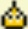  |  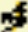  |    |  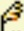  |  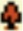  |  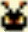  | 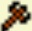   |    |  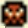  |    |    |    |    |    |    |    |
| 2- |    |    |    |    | A  | B  | C  | D  | E  | F  | G  | H  | I  | J  | K  | L  |
| 3- | M  | N  | O  | P  | Q  | R  | S  | T  | U  | V  | W  | X  | Y  | Z  | a  | b  |
| 4- | c  | d  | e  | f  | g  | h  | i  | j  | k  | l  | m  | n  | o  | p  | q  | r  |
| 5- | s  | t  | u  | v  | w  | x  | y  | z  |    |    |    |    | ‘  | ▸  | ,  | .  |
| 6- | ;  | .. |    | !  | ?  | “  | ‘l | ‘t | ‘s | ‘r | ‘m | ‘y | ‘v | ‘d | ‘e | ‘c |
| 7- | ‘n | ‘T |    |    |    |    |    | ‘t |    |    |    |    |    |    |    |    |
| 8- |    |    |    |    |    |    |    |    |    |    |    |    |    | ** | ** | ○  |
| 9- |    |    |    |    |    |    | [  | ]  | ?  | !  |    |  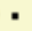  | –  | ~  | /  | *  |
| A- | (  | )  |    | :  | …  | Lv | Ex | ♂  | ♀  | ⬆  | 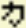   |  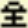  | ★  | ⬇  | ⬅  | ⮕  |
| B- | ⬉  | ⬈  | ⬋  | ⬊  |  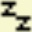  | ©  | &  |    |    |    |    |    |    |    |    |    |
| C- |    |    |    |    |    |    |    |    |    |    |    |    |    |    |    |    |
| D- |    |    |    |    |    |  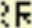  | 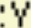   |    |    |    |    |    |    |    |    |    |
| E- | ‡  | ‡  | ‡  | ‡  | ‡  | ‡  | ‡  | ‡  | †  | §  | ** | ** | ** | ** | ** | †  |
| F- | †  | †  | ** | ** | ** | ** | ¶  | ‡  | §  | ‡* | ** | §  | §  | ** | ** | ‡  |

| Symbol | Description                 | Image |
|--------|-----------------------------|-------|
|        | blank                       |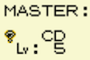|
| **     | removes the character space |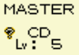|
| †      | empty name                  |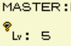|
| ‡      | crashes                     |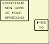|
| ‡*     | bad crash                   |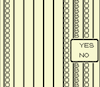|
| §      | Removes 2 spaces            |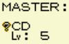|
| ¶      | replaces with master name   |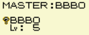|
